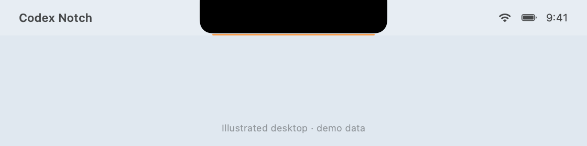
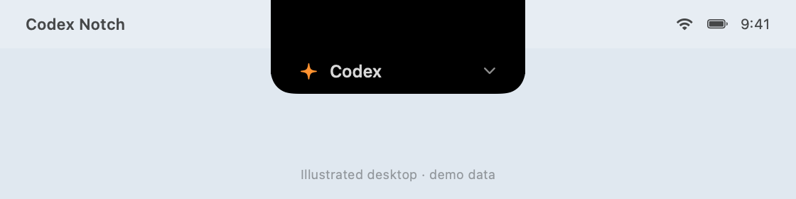
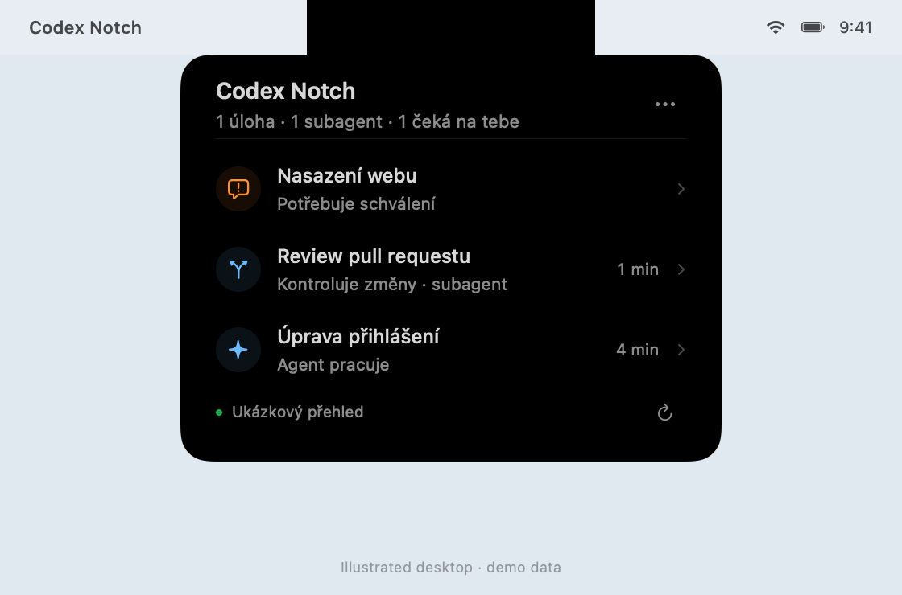

# Codex Notch

Give your MacBook notch a small job: show when Codex is working, waiting for you, or finished.

A free, open-source macOS companion built with SwiftUI and AppKit. A thin colored rim shows the current status. Bring the pointer toward the notch to reveal a small attached tab, then click to expand it into exact counts and active chats. No API key, extra subscription, or external runtime dependencies.

[Česky](README.cs.md) · [Releases](https://github.com/nemvik/codex-notch/releases) · [Report a bug](https://github.com/nemvik/codex-notch/issues/new/choose)







*Illustrations rendered from the actual SwiftUI views with demo data in an illustrative desktop context. The app interface is currently in Czech.*

## A quiet place for agent status

- **At a glance:** a colored rim distinguishes working, waiting, completed, failed, idle, and disconnected states.
- **Quiet at rest:** only the rim is visible, inside the safe menu-bar band below the camera cutout. No permanent panel covers your workspace.
- **A clear click target:** approaching the notch briefly reveals a small black tab attached to it. Clicking expands the same surface into task and subagent counts and a chat list; hover alone never opens the full overview.
- **Native details:** system typography, SF Symbols, and a compact SwiftUI chat list hosted by AppKit.
- **Read-only:** opening a chat is the only interaction with Codex. The app never approves a command, starts an agent, or interrupts work.

The resting rim stays within the menu bar and does not draw inside the physical camera cutout. The hover tab temporarily extends 32 points below the menu bar and can cover the top of an application window while revealed. It retracts shortly after the pointer leaves. The expanded overview is 336 points wide; neither state adds side wings over menu icons. A standard menu-bar item and native popover are used only as a fallback on Macs without a notch or when no safe drawable band is available.

## Build and run

Requires **macOS 13 or later**, Xcode with its Swift toolchain, and the local Codex desktop app for live status.

```bash
git clone https://github.com/nemvik/codex-notch.git
cd codex-notch
./scripts/run.sh
```

For compatibility, the app bundle remains `build/Codex Island.app`, its executable is `CodexIsland`. Open the built app again for later launches; it does not need to be moved to Applications.

**Building from source is recommended.** The planned pre-release `Codex-Notch-v0.1.0-arm64.zip` targets Apple Silicon and uses an ad-hoc signature, not Developer ID signing or notarization. Check the Releases page for availability; macOS may prevent a downloaded build from opening. Intel users should build from source; hardware behavior on Intel has not been verified.

## Using it

| Status | Meaning |
| --- | --- |
| Blue — working | Running tasks and subagents shared by the desktop |
| Orange — needs input | Waiting for a human reply or approval |
| Green — completed | Newly completed work |
| Red — failed | Newly failed work |
| Dim gray — idle | Connected, with no current activity or new results |
| Gray — disconnected | Connecting or disconnected; not a claim that nothing is running |

Move the pointer toward the notch and pause briefly to reveal the clickable tab. Move away to let it retract, or click to expand the attached overview. Exact counts and chat details appear only after a click. You can also click the notch directly. If the app is using its menu-bar fallback, click that item instead.

Click a row to open the corresponding Codex chat; a subagent opens its parent chat when known. Viewing the overview acknowledges new results. Finished rows remain for ten minutes; interruptions and lost connections are not counted as successful completions.

Click outside the overview, click the notch again, or press Escape while it has focus to close it. Its controls let you reconnect and quit. **Spouštět po přihlášení** enables launch at login through macOS; System Settings may ask you to allow the login item. Disable and re-enable that option if you move the app.

## Connection and privacy

Codex Notch reads chat IDs and source types from `~/.codex/state_<version>.sqlite` using a read-only SQLite connection. It observes the existing local desktop socket at `~/.codex/ipc/ipc.sock`, receiving versioned `thread-stream-state-changed` snapshots and updates. New chats are discovered every 15 seconds; existing chat status updates arrive through the stream.

Incoming Codex messages can transiently contain conversation text, tool output, and diffs. These are discarded; the panel retains only the metadata needed for titles and activity status. **Codex Notch does not transmit this data to the internet or write chat history.** It does not modify Codex configuration, and it needs no API credentials. Diagnostics print connection status and counts only.

## Current limits

- This is an early, independent project for the **local Codex desktop app**. VPS sessions, cloud ChatGPT conversations, and standalone CLI sessions without a shared desktop stream are not covered. Subagents count only when the desktop shares their separate live state.
- The desktop IPC is an **internal, undocumented interface**. The adapter targets stream version 11, developed against local Codex CLI 0.159.0. A Codex update may require an adapter change. Unsupported versions show a connection error; historical file activity is never substituted for live status.
- No estimated completion percentage, remote control, or approval actions. No English UI yet.
- Every Mac model, display scaling mode, and multi-monitor arrangement has not been tested on hardware. When a safe notch rim cannot be drawn, the fallback item needs space alongside your other menu items.

This project is not affiliated with or endorsed by OpenAI or Apple. Codex and macOS belong to their respective owners.

## Development

```bash
swift test
./scripts/build.sh
python3 scripts/test-adapter.py
```

The Swift suite covers IPC, catalog access, activity state, and presentation behavior. The optional Python adapter test uses temporary local sockets and databases, takes about 30 seconds, and does not read your real Codex data.

Quit any running instance before using the demo:

```bash
open "build/Codex Island.app" --args --demo --expanded
```

Demo mode uses clearly labeled sample data and does not connect to Codex. To test the actual local connection, run the bounded, ten-second diagnostic:

```bash
"build/Codex Island.app/Contents/MacOS/CodexIsland" --diagnose
```

It succeeds after a live snapshot is received. An available socket with no loaded chats can still produce exit code 1. Set `CODEX_HOME` when running the executable directly if your Codex data lives elsewhere.

Built for fun, and useful feedback is welcome. See [Contributing](CONTRIBUTING.md) for fixes and display reports, or [Security](SECURITY.md) for private reports. Contact: [codexnotch@nemvik.com](mailto:codexnotch@nemvik.com).

Released under the [MIT License](LICENSE).
